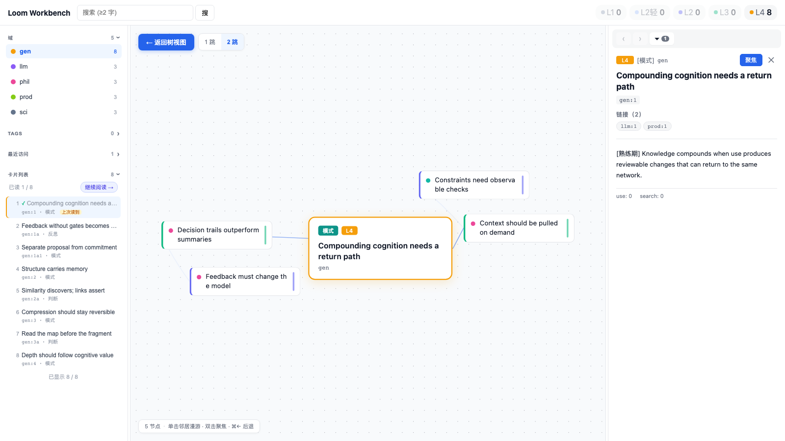

# Loom: a cognitive harness built as a knowledge network

**Language:** English | [简体中文](README.zh-CN.md)

Loom gives Claude Code and Codex a durable, inspectable way to turn source
material into understanding. Books, papers, web pages, video, and audio move
through four cognitive layers: preserved evidence, single-material digestion,
cross-material synthesis, and reusable thinking patterns.

**The defining loop:** agents digest material before use, reason through typed
and explicitly linked cards, and return new insights only through computation,
semantic checks, and review. The result is a local-first AI knowledge network
with a memory of how each idea was formed, not just where a chunk was found.

Loom can support research, Zettelkasten-style personal knowledge management,
and AI second-brain workflows. But its core artifact is not a wiki page, vector
index, chat transcript, or auto-extracted entity graph. It is a reviewable
lifecycle for building and reusing understanding.



## How Loom works

```text
source material
    ↓
L1 · original text
    ↓  Scout reads the whole work; Deep reads each unit again
L2 · single-material understanding
    ↓  THINK connects evidence across materials
L3 · synthesis, judgments, and new ideas
    ↓  cross-domain patterns pass proposal + human review
L4 · reusable ways of thinking
    ↓
USE brings the network back into an agent's context
    ↺ new, reviewable insights can return to the network
```

The four layers represent cognitive depth, not storage tiers:

| Layer | What it contains | Why it exists |
|---|---|---|
| **L1** | Preserved source text | Keeps every synthesis traceable and reversible |
| **L2** | One material, genuinely digested | Turns sources into atomic, self-contained cognitive units |
| **L3** | Cross-material synthesis | Produces comparisons, judgments, counterexamples, and new ideas |
| **L4** | Cross-domain patterns | Gives agents reusable thinking frames with explicit boundaries |

## Why it is different

- **Real digestion, not excerpting.** A Scout pass builds the whole-work map;
  Deep passes reread each unit with that map in context.
- **Typed cognition.** Cards declare their role: concept, structure, mechanism,
  case, judgment, reflection, pattern, or topic.
- **Links are the source of truth.** Explicit links carry reviewed associations;
  embeddings only discover candidates.
- **Quality-gated writes.** Deterministic checks and semantic checks run before
  drafts can enter the SQLite store.
- **A return path from use.** Asking, deciding, and reflecting can produce
  reviewable proposals instead of silently mutating the network.
- **Local-first and inspectable.** Cards, links, full-text search, vectors, and
  task traces stay on disk. Choose a local or OpenAI-compatible embedding model.

## Loom is not another name for...

These categories are useful neighbors, but they solve different primary
problems and can be combined with Loom.

| Category | Primary artifact | Typical synthesis point | Loom's distinction |
|---|---|---|---|
| **AI wiki** | Maintained pages | During ingest and page maintenance | Typed atomic cards plus explicit L1 → L4 cognitive depth |
| **RAG knowledge base** | Source chunks and retrieval index | At query time | Knowledge is digested before use and connected by reviewed links |
| **Agent memory** | Conversations, facts, preferences, episodes | During or after sessions | Loom builds durable cognition from chosen materials and reviewed thinking |
| **Knowledge graph** | Entities and relations | During extraction | Loom's graph also records cognitive role, derivation layer, and feedback gates |

## Quick start

Requirements: macOS or Linux, Python 3.11+, Claude Code or Codex, and an
embedding model.

```bash
git clone https://github.com/q8886b/loom-ai-knowledge-network.git
cd loom-ai-knowledge-network
./install.sh
loom on
```

For a fully local setup, install [Ollama](https://ollama.com), then configure
`~/.loom/.env`:

```bash
ollama pull bge-m3
```

```dotenv
LOOM_EMBED_PROVIDER=ollama
LOOM_EMBED_MODEL=bge-m3
LOOM_EMBED_DIM=1024
```

Put a Markdown source under `~/.loom/sources/`, then ask your agent:

> Use `loom-digest` to digest this material into L2: `/absolute/path/to/source.md`

The agent reads the source, writes drafts, runs the computation and semantic
gates, and commits only after both pass. Explore the result:

```bash
loom search "your topic"
loom tui
```

See the [quick-start guide](docs/quickstart.md) for embedding providers, hooks,
the web Workbench, and project-local installation.

## Agent skills included

`./install.sh` links the complete skills into Claude Code and Codex while the
repository remains their single source of truth.

| Skill | Purpose |
|---|---|
| `loom-digest` | Two-pass source digestion from L1 to L2 |
| `loom-think` | Cross-material research, synthesis, and reflection |
| `loom-use` | Answer questions and make decisions through the existing network |
| `loom-pipeline` | Orchestrate multi-resource ingest, digest, and synthesis runs |
| `resource-to-markdown` | Convert PDF, EPUB, web, Office, audio, and video sources to Markdown |

## Storage and retrieval

- SQLite + FTS5 for cards and full-text search
- `sqlite-vec` for optional semantic retrieval
- Explicit bidirectional links for the durable knowledge graph
- Markdown mirrors for source material and readable card artifacts
- TUI and local web Workbench for browsing, search, annotation, and graph exploration

Loom's Workbench is local and serves card content without authentication. Do
not expose it directly to a public network.

## Design

The current design baseline is:

- [004 — Layered redesign: purpose and principles](docs/design/004-layered-redesign-purpose.md)
- [005 — Layered redesign: harness implementation](docs/design/005-layered-redesign-harness.md)

## Status

Loom is alpha software. The data model and guarded write path are implemented;
interfaces and installation details may still change before 1.0.

## Development

```bash
python3.11 -m pip install -e ".[dev]"
python3.11 -m pytest
```

Contributions are welcome. Read [CONTRIBUTING.md](CONTRIBUTING.md), the
[security policy](SECURITY.md), and the [code of conduct](CODE_OF_CONDUCT.md).

## License

[MIT](LICENSE)
